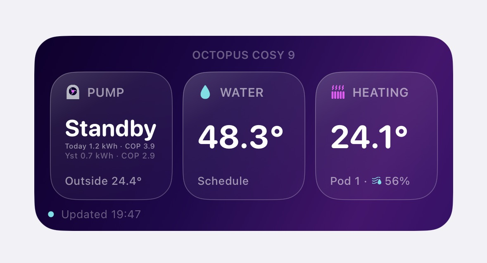
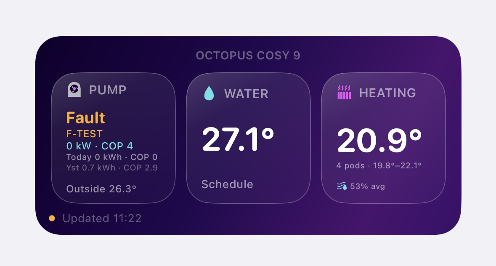

# Cosy Watch — Octopus Cosy Heat Pump Widget for iPhone

Cosy Watch is an unofficial iPhone widget for Octopus Cosy heat pumps. It runs in [Scriptable](https://scriptable.app/) and displays useful heat pump information directly on your iOS Home Screen.

I built this because the Octopus app does not currently provide a Home Screen widget for Cosy heat pumps, and other users appeared to be looking for the same thing. This project is intended to help other Octopus Cosy owners who want a quick glance at what their heat pump is doing.

> **Important:** this is an unofficial community project. It is not made, supported, or endorsed by Octopus Energy.

## What the widget shows

The medium widget can show:

- Heat pump status, including standby, running, heating water, offline, and fault states
- Fault warnings with amber highlighting
- Fault codes, where available from the API
- Current hot water cylinder temperature
- Current power input and heat output
- Current COP, where available
- Today’s energy use and COP
- Yesterday’s energy use and COP
- Outdoor temperature
- Cosy Pod room temperatures
- Average room temperature across multiple pods
- Temperature range across pods
- Average humidity across pods
- Last updated time
- Fallback to the last saved readings if the API request fails

A small widget layout is also included. The medium widget gives the best view.

## Screenshots

Add your screenshots to the `screenshots` folder and update these links if needed.

### Normal operation



### Fault state



## Requirements

You will need:

- An iPhone
- The [Scriptable app](https://scriptable.app/) installed
- An Octopus Energy account
- An Octopus Cosy heat pump
- Your Octopus API key

## Security warning

Your Octopus API key gives access to your Octopus account data.

Please do not:

- Share your API key with anyone
- Post screenshots that show your API key
- Upload a copy of the script with your real API key included
- Send your API key to someone else for troubleshooting

The script file in this repository uses this placeholder:

```javascript
const API_KEY = "PASTE_YOUR_API_KEY_HERE";
```

Only replace that placeholder on your own device inside Scriptable.

## How to install

### 1. Install Scriptable

Download Scriptable from the App Store.

### 2. Get your Octopus API key

Log in to your Octopus Energy account and find your API key under your account settings/API access area.

Copy the key that starts with `sk_live_`.

Keep this key private.

### 3. Copy the script

Open the file:

```text
src/cosy-watch.js
```

Copy all of the code.

### 4. Create a new Scriptable script

Open Scriptable on your iPhone.

Tap the plus button to create a new script.

Paste the full code into the new script.

### 5. Add your API key

Near the top of the script, find this line:

```javascript
const API_KEY = "PASTE_YOUR_API_KEY_HERE";
```

Replace `PASTE_YOUR_API_KEY_HERE` with your own Octopus API key.

For example:

```javascript
const API_KEY = "sk_live_your_api_key_here";
```

Do not share this edited version of the script.

### 6. Optional: name your Cosy Pods

If you want the widget to show room names instead of Pod 1, Pod 2, and so on, edit this section:

```javascript
const POD_NAMES = {
  1: "Living Room",
  2: "Bedroom",
  3: "Kitchen",
  4: "Hallway"
};
```

Leave any pod name blank if you want the default label.

### 7. Run the script once

Run the script inside Scriptable.

The first run tries to find your Octopus account number and heat pump controller ID automatically. The details are then saved in the iOS Keychain for future runs.

If everything works, you should see the widget preview.

### 8. Add the widget to your Home Screen

On your iPhone Home Screen:

1. Press and hold on the Home Screen
2. Tap the **+** button
3. Search for **Scriptable**
4. Add a **medium** Scriptable widget
5. Press and hold the widget
6. Tap **Edit Widget**
7. Choose your Cosy Watch script

The widget should then appear on your Home Screen.

## Notes about refresh behaviour

iOS controls how often Home Screen widgets refresh. The script asks for a refresh every 10 minutes, but iOS may refresh it less often.

This is normal behaviour for iPhone widgets and cannot be fully controlled by the script.

## Troubleshooting

### The widget says I need to add an API key

Check that you replaced:

```javascript
PASTE_YOUR_API_KEY_HERE
```

with your real Octopus API key.

### The widget cannot find my heat pump

Check that:

- Your API key is correct
- Your heat pump appears under Devices in the Octopus app
- Your Octopus account has access to the heat pump data

### The widget is not refreshing often enough

This is controlled by iOS. The widget requests a refresh, but iOS decides when to run it.

### Some values are missing

Some values depend on what the Octopus API returns at that time. If a value is not available, the widget may show a fallback or blank value.

## Known limitations

- Uses Octopus heat pump API endpoints that are not officially documented for this use case
- API changes by Octopus may break the widget
- iOS controls widget refresh timing
- Built and tested on an Octopus Cosy 9
- Other Cosy setups may behave differently
- Scriptable cannot produce a true iOS blur effect, so the widget uses a simulated glass style

## Future ideas

Possible future improvements:

- Improved setup guide with screenshots
- Larger widget layout
- More detailed fault explanations
- Optional colour themes
- Historical energy trends
- Multiple property support
- More options for naming and displaying Cosy Pods

## Repository structure

```text
cosy-watch-octopus-heat-pump-widget/
├── src/
│   └── cosy-watch.js
├── docs/
│   └── index.html
├── screenshots/
│   ├── normal-operation.png
│   └── fault-state.png
├── README.md
├── RELEASE_NOTES.md
├── CONTRIBUTING.md
├── LICENSE
└── .gitignore
```

## Licence

This project is released under the MIT Licence. See `LICENSE` for details.

## Disclaimer

This project is not affiliated with Octopus Energy. Octopus, Octopus Energy, Cosy and related product names are owned by their respective owners.

Use this script at your own risk. Always keep your API key private.
